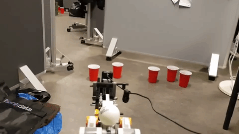

# SABR

Self-Aiming Ballistic Robot (SABR) is a robot that shoots projectiles at red cups. It uses TensorFlow for object detection and a similar triangles method for distance approximation. It is able to offload and process images on a separate machine through TCP/IP.

